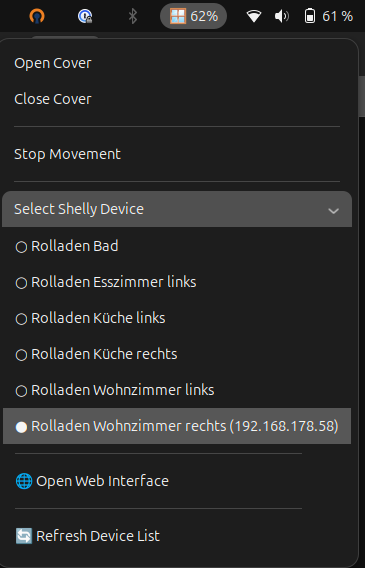

# Shelly Cover Control - GNOME Shell Extension

A native, lightweight GNOME Shell extension that puts your local Shelly Cover devices (like the Shelly Plus 2PM or Pro 2PM) right in your top panel.

It operates entirely locally over your network using the Shelly HTTP RPC API and mDNS—no cloud accounts or internet connection required.

## ✨ Features



* **Real-Time Status:** Shows the exact position of your cover right in the top bar (e.g., `🪟 45%`).
* **Live Movement Indicators:** Displays directional arrows (`▲` / `▼`) while your blinds or shutters are actively moving.
* **Zero-Config Discovery:** Automatically finds Shelly devices on your local Wi-Fi/LAN using mDNS.
* **Smart Filtering:** Extracts your custom Shelly device names (e.g., *"Wohnzimmer Rolladen"*) and ignores Shelly relays configured as standard light switches.
* **Persistent Memory:** Remembers your selected device across system reboots.
* **Sleep Aware:** Safely pauses background network polling when your Linux machine goes to sleep and auto-heals connections when waking up.
* **Quick Web Access:** One-click shortcut to open the active device's local web configuration page in your default browser.


## 🛠 Prerequisites

This extension relies on standard Linux Avahi tools for local network mDNS discovery. You must have this package installed on your system:

**Ubuntu / Debian / Linux Mint:**
```bash
sudo apt install avahi-utils
```

**Fedora:**
```bash
sudo dnf install avahi-tools
```

**Arch Linux:**
```bash
sudo pacman -S avahi
```

## 📦 Installation (Manual)

1. Clone this repository directly into your GNOME Shell extensions directory:
   ```bash
   git clone git@github.com:firebirdberlin/shelly-cover-control.git ~/.local/share/gnome-shell/extensions/shelly-cover-control@firebirdberlin
   ```

2. Enable the extension using the GNOME CLI:
   ```bash
   gnome-extensions enable shelly-cover-control@firebirdberlin
   ```

3. **Restart GNOME Shell** so it registers the new extension:
   * **X11:** Press `Alt + F2`, type `r`, and press `Enter`.
   * **Wayland:** Log out of your desktop session and log back in.

## ⚙️ Compatibility

* **GNOME Shell:** 45, 46, 47, 48 (ESM imports)
* **Shelly Devices:** Any Gen2/Gen3 Shelly device supporting the `Cover` RPC profile (e.g., Shelly Plus 2PM, Shelly Pro 2PM, Shelly 2PM Gen3). *Note: The device must be calibrated in the Shelly app for percentage readouts to work.*

## 💚 Open Source & Donations

This extension is free and open-source software. If you find it useful and would like to support its development, you are welcome to buy me a coffee or sponsor my work!

* [](https://www.buymeacoffee.com/firebirdberlin)
* [](https://github.com/sponsors/firebirdberlin)

## 🐛 Troubleshooting

* **Empty Dropdown Menu:** Ensure your computer and your Shelly are on the same local subnet. Wait a few seconds and click "Refresh Device List".
* **Menu says "Err" or "Off":** The selected device may have lost Wi-Fi connection or changed IPs. Refresh the device list to update the mDNS cache.
* **Can't see the extension:** Double-check that the folder name exactly matches `shelly-cover-control@firebirdberlin` inside `~/.local/share/gnome-shell/extensions/`.
